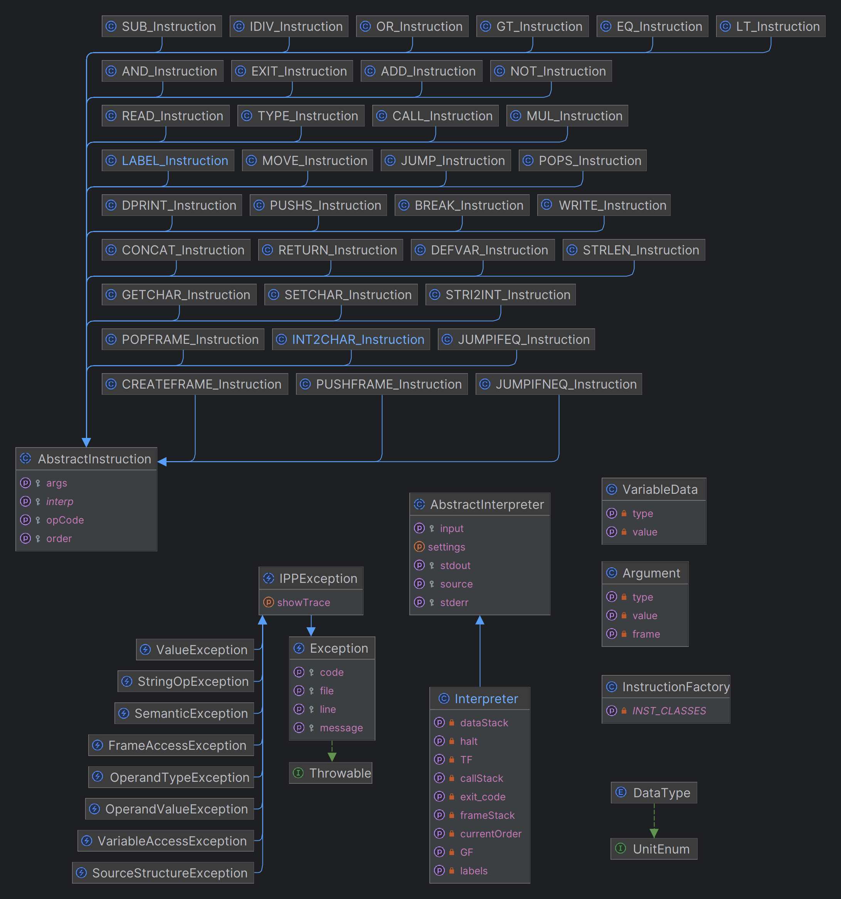

Implementačná dokumentácia k 2. úlohe do IPP 2023/2024 \
Meno a priezvisko: Maroš Berdis \
Login: xberdi01

## Kontrola XML formátu
Pred spracovaním vstupu na konkretné inštrukcie s danými argumentami a ich následne vykonanie je potrebné overiť validitu `XML` formátu vstupu. Správnosť názvu inštrukcie a typu argumentov kontrolujem overením ich výskytu v konštantnom poli `OP_CODES` resp. `ARG_TYPES`. V prípade odhalenia chyby je vyvolaná výnimka `XMLException` alebo `SourceStructureException`. Na konci kontroly, zoradím inštrukcie podľa atribútu `order`, ktorý neskôr slúži na určenie poradia, v ktorom sú inštrukcie vykonávane.

## Rozdelenie tried inštrukcií
Každý typ inštrukcie (napr. `MOVE`, `ADD`, ...) má svoju triedu. Každá trieda má vlastný ***.php*** súbor, pomenovaný názvom danej triedy. Súbory sú zoskupené podľa kategorií do priečinkov, a triedy majú patričný `namespace` aby bol dodržaný štandard ***PSR-4 autoloader***. Tieto triedy majú spoločného rodiča abstraktnú triedu `AbstractInstruction`. Každá trieda musí implementovať metódu `execute()`, ktorá bude volaná nad daným objektom pri interpretácií. Inštrukcia `LABEL` sa líši od ostatných tým, že jej funkcionalita je definovaná v konštruktore a `execute()` metóda je **NOP**. Je to z dôvodu, že inštrukcia `LABEL` pridáva záznam do asociatívneho poľa (`label` => `order`) a to chceme aby sa vykonalo iba raz. Pred začiatkom vykonávania inštrukcií nastaví Interpet referenciu na seba do statickej premennej triedy `AbstractInstruction`. Pomocou tejto referencie budú inštrukcie pristupovať k metódam interpretra. 

## Vytváranie objektov reprezentujúcich inštrukcie
Z každého `XML instruction` uzlu extrahujem `opcode`, `order` a z jeho argument uzlov vytvorím objekty triedy `Argument`, ktorá bude obsahovať ich hodnotu, typ a v prípade premennej, názov rámca. Tieto premenné sú predané **továrni na inštrukcie**, ktorá na základe `opCode` vytvorí inštanciu správneho typu triedy. Továreň má asociatívne pole, ktoré mapuje `opCode` na triedu typu inštrukcie (napr. `"MOVE" => MOVE_Instruction::class`).
```php 
foreach ($xmlInstructions as $instructionNode) {
    $opCode = strtoupper($instructionNode->getAttribute("opcode"));
    $order  = $instructionNode->getAttribute("order");
    $args   = $this->get_args($instructionNode);
    // instruction factory will return constructed child of AbstractInstruction based on the opCode given.
    $instructions[$order] = InstructionFactory::create_Instruction($order, $opCode, $args);
}
```


## Pamäťové rámce
Pre jednoduchosť prístupu k metódam pracujúcimi s pamätovými rámcami som sa rozhodol implementovať pamäťové rámce pomocou privátnych asociatívnych polí triedy `Interpreter`, ktoré mapujú meno premennej na objekt triedy `VariableData`, ktorý drží hodnotu a typ danej premennej. Medzi tieto polia patria `GF`, `TF` a `frameStack`, pričom `frameStack` reprezentuje zásobník rámcov a aktuálny pamätový rámec značíme `LF (Local Frame)`. Podobne je implementovaný aj dátovy zásobník `dataStack` avšak v tomto prípade to je už iba klasické pole `VariableData` objektov bez asociácie s meno premennej. S pamäťovými rámcami pracujú inštrukcie výhradne cez verejné metódy interpretra.  

## Riadenie vykonávania inštrukcií
Hlavnou komplikáciou tejto časti interpretra bolo to, že `XML` atribút inštrukcií `order`, ktorý používam na riadenie poradia, nemusí byť rovnomerne rozostúpeny (napr. `2, 3, 5, 8, 13`). Tento fakt **zabráňuje riešeniu** jednoduchým `for` cyklom, v ktorom by premenná `i` (od 1 po n) priamo obsahovala číslo prvku aktuálnej inštrukcie a ak by daná inštrukcia menila poradie (napr. `JUMP`), stačilo by aktualizovať premennú `i` hodnotou asociovanou s daným návestím. Myšlienka však zostala podobná, doplnil som ju o pomocné pole s kľúčmi do ktorého premenná `i` odkazuje. Po vykonaní inštrukcie sa vyhľadá nová hodnota `i` ktorá odpovedá `currentOrder`, ktorý mohol byť zmenený vykonaným skokom.


```php
// array of instruction orders, orders are in non-descending order. They dont have to be evenly spaced!
$instKeys = array_keys($instructions);

for ($i = 0; ($i < count($instKeys)) && !$this->halt; $i++)     // i is used for getting correct order
{ 
    $this->currentOrder = $instKeys[$i];
    $instructions[$this->currentOrder]->execute();
    $i = array_search($this->currentOrder, $instKeys);  // update $i, jump could change $currentOrder
}
```

## UML Diagram tried
